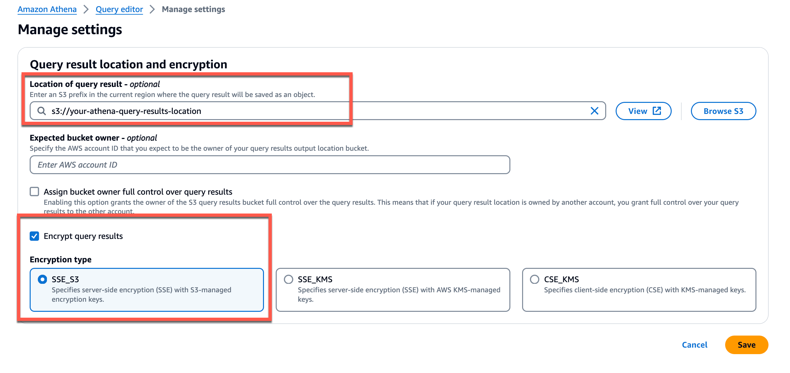

# Guidance for Amazon S3 Object Level Insights & Cost Savings on AWS

## Table of Content

1. [Overview](#overview)
    - [Cost](#cost)
2. [Prerequisites](#prerequisites)
    - [Operating System](#operating-system)
3. [Deployment Steps](#deployment-steps)
4. [Deployment Validation](#deployment-validation)
5. [Running the Guidance](#running-the-guidance)
6. [Next Steps](#next-steps)
7. [Cleanup](#cleanup)
8. [FAQ, known issues, additional considerations, and limitations](#faq-known-issues-additional-considerations-and-limitations)
9. [Revisions](#revisions)
10. [Notices](#notices)
11. [Authors](#authors)

## Overview

This solution provides object-level insights that allow you to track Amazon S3 usage patterns and reduce costs by transitioning objects to more cost-effective storage classes based on access frequency and lifecycle requirements.

The objective of this solution is as follows:

- Cost Savings by only transitioning objects not accessed to cheaper storage classes
- Object level insights in the bucket such as but now limited to:
- List of objects accessed in the last 90 days
- List of objects not accessed in the last 90 days
- List of objects deleted in the last 90 days

The high-level architecture for the project is as follows:

  
*Figure 1*

The services used to create this architecture:

- Amazon S3
- Amazon Athena
- Amazon QuickSight
- AWS Glue

Amazon S3 has multiple native functionalities included with it. You will be using the following:

- Server Access Logging
- S3 Inventory
- S3 Batch Operation Jobs
- S3 Lifecycle Rules

### Cost

This section is for a high-level cost estimate. Think of a likely straightforward scenario with reasonable assumptions based on the problem the Guidance is trying to solve. Provide an in-depth cost breakdown table in this section below ( you should use AWS Pricing Calculator to generate cost breakdown ).

You are responsible for the cost of the AWS services used while running this Guidance. As of May 2024, the cost for running this Guidance with the default settings in the us-east-1 (N. Virginia) region is approximately $544 per month for processing. Refer to the cost table below.

We recommend creating a [Budget](https://docs.aws.amazon.com/cost-management/latest/userguide/budgets-managing-costs.html) through [AWS Cost Explorer](https://aws.amazon.com/aws-cost-management/aws-cost-explorer/) to help manage costs. Prices are subject to change. For full details, refer to the pricing webpage for each AWS service used in this Guidance.

### Sample Cost Table

The following table provides a sample cost breakdown for deploying this Guidance in the US East (N. Virginia) region for one month.

| AWS service  | Dimensions | Cost [USD] |
| ----------- | ------------ | ------------ |
| AWS Glue | 100 DPU's, 1 hour  | $88 / run |
| Amazon S3 Server Access Logs | 1TB bucket size | $23.00 / month |
| Amazon S3 Inventory | 100GB bucket size  | $28 / month |
| Amazon Athena | Querying 20TB of data   | $100 / run |
| Amazon QuickSight | 1 region, 1 author | $284 / month |
| Amazon S3 Batch Operations | 20 million objects  | $ 21 / run |

## Prerequisites

The following prerequisites are required to deploy this solution:

- [AWS CLI](https://docs.aws.amazon.com/cli/latest/userguide/getting-started-install.html) configured to your desired region.
- Console access to Amazon S3.
- Console access to Amazon Athena.
- Console access to Amazon Glue.

### Operating System

These deployment instructions are optimized to be run in the AWS Console on a chromium based browser or Firefox and the AWS CLI. If running through the Windows Powershell or another browser, additional steps may be required.

## Deployment Steps

1. Run the following command to clone the repo. ```git clone https://github.com/aws-solutions-library-samples/guidance-for-amazon-s3-object-level-insights-and-cost-savings.git```. This repository contains the resources like queries that you will use in the solution.

2. Navigate to the deployment folder and run the following command to deploy the AWS CloudFormation template to run this solution.

    ```shell
    aws cloudformation create-stack --stack-name s3-cost-optimize-stack --template-body file://cf-template.yml --capabilities CAPABILITY_NAMED_IAM
    ```

    It will deploy the following resources:

    - An S3 buckets for Inventory, Server Access Logs, and a AWS Glue job
    - A service role for the Glue job to grant it permissions access resources in S3 and perform its job.

    Verify that the CloudFormation template deployed correctly by navigating to AWS CloudFormation and finding the stack named **s3-cost-optimize-stack**. The bucket names are found under the **outputs** tab.


*Figure 2*

3. Turn on Server Access Logs from your Source Bucket (Main Bucket).

    - Open your source bucket.
    - Navigate to **Properties -> Edit Server Access Logging -> Enable Server Access Logging**.
    - Set the destination to your Sal bucket and add **SalOriginal** as a prefix. Ex: **s3://server-access-logs-bucket-{id}/SalOriginal/**  (This creates a folder inside your server access logs bucket and dumps reports in that prefix)
    - Select ([DestinationPrefix]/[YYYY]-[MM]-[DD]-[hh]-[mm]-[ss]-[UniqueString] ) log format and save changes

4. Configure Inventory reports for Source Bucket to send to the inventory bucket.

    - Navigate to **Management -> Create Inventory configuration** in you source bucket.
    - Input configuration name and select this account if your inventory bucket is in the same account
    - Input destination- **s3://inventory-bucket-{id}/InventoryReports** (This adds a prefix to the inventory reports generated in your bucket)
    - Select daily frequency and Apache parquet output format (We recommend having inventory reports in Apache parquet format for better efficiency)
    - Enable the status
    - Select server-side encryption if your business requires it
    - Select metadata fields as required (We recommend having everything turned on)
    - Save the configuration

Note: You can enable server access logs for the inventory reports and server access logs buckets if required.

5. Initialize a database and inventory table in Athena

    - Open the Amazon Athena Console
    - Please select one of these eleven regions as Quicksight is only supported in eleven regions as Quicksight and Athena have to be in the same region to function. (US East (Ohio) (us-east-2), US East (N. Virginia) (us-east-1), US West (Oregon) (us-west-2), Asia Pacific (Mumbai) (ap-south-1), Asia Pacific (Seoul) (ap-northeast-2), Asia Pacific (Singapore) (ap-southeast-1), Asia Pacific (Sydney) (ap-southeast-2), Asia Pacific (Tokyo) (ap-northeast-1), Canada (Central) (ca-central-1), Europe (Frankfurt) (eu-central-1), Europe (Ireland) (eu-west-1), Europe (London) (eu-west-2), Europe (Paris) (eu-west-3), Europe (Stockholm) (eu-north-1), South America (São Paulo) (sa-east-1))
    - If this your first time using Athena you will need to configure the location of your Athena results. Use the buckets provided by the solution to ensure results encrypted in transit using TLS:
        - In the Query Editor, navigate to settings, then click **manage**.
        - Set the location of your query results to your desired S3 bucket location. Choose the Query location
        - Check **Encrypt query results**

        


    - In the Query editor, run the following DDL statement to create the s3_access_logs_db database: ( Note: It's a best practice to create the database in the same AWS Region as your S3 bucket.) (Athena may not allow you to run this query until you save the location for your query results, manually enter the query result location in settings for Athena).

        ```sql
        create database s3_access_logs_db
        ```

    - Run the following statement to create the inventory table. Change the Location to the location of the hive folder in your inventory bucket destination. (Note: Hive folder creation will take 24-48 hours after turning on S3 Inventory Reports)

        ```sql
            CREATE EXTERNAL TABLE myinventory(
                    bucket string,
                    key string,
                    version_id string,
                    is_latest boolean,
                    is_delete_marker boolean,
                    size bigint,
                    last_modified_date bigint,
                    e_tag string,
                    storage_class string,
                    is_multipart_uploaded boolean,
                    replication_status string,
                    encryption_status string,
                    object_lock_retain_until_date bigint,
                    object_lock_mode string,
                    object_lock_legal_hold_status string,
                    intelligent_tiering_access_tier string,
                    bucket_key_status string,
                    checksum_algorithm string
            ) PARTITIONED BY (
                    dt string
            )
            ROW FORMAT SERDE 'org.apache.hadoop.hive.ql.io.parquet.serde.ParquetHiveSerDe'
            STORED AS INPUTFORMAT 'org.apache.hadoop.hive.ql.io.SymlinkTextInputFormat'
            OUTPUTFORMAT 'org.apache.hadoop.hive.ql.io.IgnoreKeyTextOutputFormat'
            LOCATION 's3://inventory-bucket-{id}}/<PathToInventoryReports>/hive/'
        ```
  
  The inventory table and database are set up. Next is to configure access logs in Athena so we can query both the tables to get the desired outcome. For achieving the highest efficiency in terms of cost and scalability, we will use AWS Glue to convert server access logs from its original format (Loosely structured, space-separated, newline-delimited ) to Apache parquet format.

6. Download and Initialize AWS Glue job from GitHub repo to convert format of server access logs to Apache Parquet.

    - Download the zip code from [https://github.com/awslabs/athena-glue-service-logs](https://github.com/awslabs/athena-glue-service-logs)
    - After downloading the folder, go to **scripts/example_glue_jobs** and make changes to the **S3_CONVERTED_TARGET** and **S3_SOURCE_LOCATION** to set your parquet destination and source location:

        ```json
        "s3_access": {
                "s3_access": {
                "JOB_NAME_BASE": "S3Access",
                "RAW_TABLE_NAME":"s3_access_raw_logs",
                "CONVERTED_TABLE_NAME":"s3_access",
                "S3_CONVERTED_TARGET":"s3://server-access-logs-bucket-{id}/SalParquet/",
                "S3_SOURCE_LOCATION":"s3://server-access-logs-bucket-{id}/SalOriginal/"
            },
        ```

7. Stage the Glue Job.

    - Open Terminal or Powershell
    - In the AWS Cli, make sure the AWS region is the same region is the same region where you created your S3 buckets; for example, if you created your buckets in us-east-1, then run the following command in terminal to set the region to us-east-1: ```export AWS_REGION=us-east-1```.

      Note: Your should have the the following policies:

        - AmazonS3FullAccess
        - AWSGlueConsoleFullAccess
        - AwsGlueDataBrewFullAccessPolicy
        - AWSGlueDataBrewServiceRole
        - AWSGlueServiceRole
        - IAMUserChangePassword

    - Navigate to the directory of the glue script.
    - Run the following commands in terminal (For Mac Users) once in the root directory for the unzipped folder. Update the RELEASE_BUCKET variable with the output of the glue job bucket in the CloudFormation stack outputs.:

        ```shell
        RELEASE_BUCKET=glue-job-bucket-{id} make private_release  
        ```

        ```shell
        RELEASE_BUCKET=glue-job-bucket-{id} make create_job service=s3_access
        ```

      - Once all the above steps are completed, you should have a glue job created in your region in AWS Glue.

8.  Run the Job
      - Go to **AWS Glue Console > Data Integration > ETL Jobs**
      - Open the created job.
      - Select **AWSGlueServiceRoleDefault-{cf-id}** as the IAM role for this job.
      - Select Spark as type
      - Select Glue Version 4.0
      - Select Python3 as Language
      - Select G2X and 200 workers ( You can increase the number of workers to make job faster )
      - Enable Job Bookmark
      - Select Advanced properties and fill in the information into Job Parameters shown below:

        | Key                       | Value                                             |
        | ------------------------- | ------------------------------------------------- |
        | --converted_database_name | aws_service_logs                                  |
        | --converted_table_name    | s3_access                                         |
        | --raw_database_name       | aws_service_logs_raw                              |
        | --raw_table_name          | s3_access_raw_logs                                |
        | --s3_converted_target     | s3://server-access-logs-bucket-{id}/sal-parquet/  |
        | --s3_source_location      | s3://server-access-logs-bucket-{id}/sal-original/ |

 Be sure to change the values for S3 converted target and s3 source location to point to your environment details.

 Save and run the job.

 Now we have set up both server access logs and inventory reports set up in Amazon Athena.

 9. View Server Access logs.

    - Navigate to AWS Athena.
    - Change the database in Amazon Athena console to the glue database which was just created and updated.
    - Update both the tables by loading the partitions.Partitions need to be loaded on every new day in Athena to load new server access logs and inventory.
    - Click the three vertical dots icon in the particular table and select load partitions.

    *Note: Make Sure to run “LOAD PARTITIONS” FOR THE “myinventory” table within the “s3_access_logs_db” database AND for the “s3_access” table within the “aws_service_logs” database each time you want to run analytics as new inventory and new server access logs need to be updated in Athena*.

    You are ready to run the queries.


*Figure 3*

### Deployment Validation  

The following will be true if deployed successfully:

- The CloudFormation template will have the status of create complete, and you will see three S3 buckets starting with the names **server-access-logs-bucket-**, **inventory-bucket-**, and **glue-job-bucket-**.
- The Glue Job ran successfully.

## Running the Guidance

Run Athena queries to get the desired outcomes.

The queries below will give us object level insights which S3 doesn’t provide at the moment. You can change the results in any of the queries to give you details about “X” days by simply replacing “90” in the codes below to your desired number of days.

## Athena Query1: Objects accessed in the last 90 days

```sql
WITH latest_partition AS (
    SELECT MAX(dt) value FROM s3_access_logs_db."myinventory$partitions"
),
latest_inventory AS (
    SELECT
        key,
        storage_class
    FROM myinventory mi
    INNER JOIN latest_partition lp ON mi.dt=lp.value 
)

SELECT 
    li.key,
    bucket,
    storage_class
    
    -- ,al.request_uria
    ,al.operation
    ,al.time
    ,al.object_size
FROM latest_inventory li 
INNER JOIN  "aws_service_logs"."s3_access" al on li.key=al.key
WHERE (time > date_add('day', -90, date(now())) and operation='REST.GET.OBJECT')
OR (time > date_add('day', -90, date(now())) and operation='REST.PUT.OBJECT')

```

## Athena Query2: Objects not accessed in the last 90 days

```sql
WITH latest_partition AS (
    SELECT MAX(dt) value FROM s3_access_logs_db."myinventory$partitions"
),
latest_inventory AS (
    SELECT key FROM myinventory mi
    INNER JOIN latest_partition lp ON mi.dt=lp.value
)
    SELECT  
        key
    FROM latest_inventory li 
    WHERE EXISTS (
        SELECT bl.*
        FROM "aws_service_logs"."s3_access" bl
        WHERE li.key = bl.key
        AND operation IN ('REST.GET.OBJECT','REST.PUT.OBJECT')
        AND time < date_add('day', -90, date(now()))
    )
    AND NOT EXISTS (
        SELECT * 
        FROM "aws_service_logs"."s3_access" bl
        WHERE li.key = bl.key
        AND operation IN ('REST.GET.OBJECT','REST.PUT.OBJECT')
        AND time > date_add('day', -90, date(now()))
    )

```

## Athena Query3: Objects deleted in the last 90 days

```sql
SELECT DISTINCT mi.key
    -- get keys for objects that were deleted in last 90 days
    ,mi.bucket
    ,mi.storage_class
    
    -- ,bl.request_uri
    -- ,bl.operation
    --,bl.time
    -- ,bl.object_size

from "aws_service_logs"."s3_access" bl
inner join  myinventory mi on bl.key=mi.key
WHERE (time > date_add('day', -90, date(now())) and operation='REST.DELETE.OBJECT')
```

## Athena Query4: List of all objects

```sql
WITH latest_partition AS (
    SELECT MAX(dt) value FROM s3_access_logs_db."myinventory$partitions"
)

    SELECT
        key,
        storage_class
    FROM myinventory mi
    INNER JOIN latest_partition lp ON mi.dt=lp.value  
```

Please note the following:

- You can change the number of days in any query by just replacing the -90 part with amount of days
- You can add other metadata to the queries by adding the bucket alias + metadata name (for eg: mi.e_tag for etag metadata)

## Visualize insights with Amazon Quicksight

Next step is to save the results for these queries by creating a view for analyzing the data on QuickSight. Please follow the steps below:

1. Go on each of the queries and select create view and name the view
2. Open QuickSight console and select new analysis
3. Once in new analysis please follow these steps, new dataset—Athena— MyAthenaDashboard
4. Select your database and the view for Athena query 1 (Objects accessed in last 90 days) 
5. Select Horizontal Chart bar with Storage class and key in y axis and Operations(count) in value. For Objects in respect to date requested, select Pivot Chart as the graph with key in rows and time in Columns ( Refer to Figure 3 below for other views)
6. For Athena query 2 (objects not accessed in last 90 days) repeat steps 1-3
7. Select your database and view for Athena query 2.
8. Select horizontal bar chart to view Objects not accessed in last 30 days by storage class. Assign storage class and key to y-axis and key to value(Refer to Figure 4 below).
9. For Athena query 3 (list of all objects) repeat steps 1-3
10. Select your database and the view for Athena query 1 (List of all objects)
11. Select horizontal bar chart to view list of objects by storage class and assign Storage class & key to y-axis and key to value (refer to figure 5 below)


*Figure 4*


*Figure 5*


*Figure 6*

## Optional: Delete or Transition Objects in the Bucket Which Have not Been Accessed in the Last 90 Days

1. Run the query below which fetches a list of all objects not accessed in 90 days ( it ignores recent puts too).

    ```sql
    WITH latest_partition AS (
    SELECT MAX(dt) value FROM s3_access_logs_db."myinventory$partitions"
    ),
    latest_inventory AS (
        SELECT
        key,
        bucket
        FROM myinventory mi
        INNER JOIN latest_partition lp ON mi.dt=lp.value
    )
        SELECT  
        key,
        bucket
        FROM latest_inventory li 
        WHERE EXISTS (
            SELECT bl.*
            FROM "aws_service_logs"."s3_access" bl
            WHERE li.key = bl.key
            AND operation IN ('REST.GET.OBJECT','REST.PUT.OBJECT')
            AND time < date_add('day', -90, date(now()))
        )
        AND NOT EXISTS (
            SELECT * 
            FROM "aws_service_logs"."s3_access" bl
            WHERE li.key = bl.key
            AND operation IN ('REST.GET.OBJECT','REST.PUT.OBJECT')
            AND time > date_add('day', -90, date(now()))
        )
    ```

1. After you run the query, save the query and head over to the Athena Query saved results location to copy the path of the file.

1. Tag all the objects that have not been accessed in last 90 days for deletion:

   - On the AWS Console go to the Amazon S3 Batch operations and select your region
   - Create a new job and paste the S3 url you copied above in Manifest object field
   - Select replace all object tags and tag them as “delete” and “true” for key and value respectively and hit next
   - Select a path to publish job results
   - Configure an IAM role which allows Batch to access S3
   - Create the job
   - Once created, run the job

    *Note: The steps above will delete the objects, if the use case is for transition of objects to other storage classes, replace bullet #3 with the tags below and follow the rest as mentioned above.*

1. Select replace all object tags and tag them as “glacier” and “true” for key and value respectively and hit next

1. This job will tag all the objects in the bucket that have not been accessed in the last 90 days for deletion/transition. We will now create a lifecycle rule to delete all the objects that have been tagged for deletion/transition

    - For Deletion: In the Mainbucket, go to management and create a lifecycle rule to expire current versions of objects after 0 days which have the following tags “delete” in key, “true” in value

    - For Transition: In the Mainbucket, go to management and create a lifecycle rule to transition objects after 0 days which have the following tags “glacier” in key, “true” in value to whatever storage class you want to transition to

    **S3 Lifecycle rule will act on all the objects with those tags and hence delete/transition the objects resulting in cost savings.**

## Next Steps

Provide suggestions and recommendations about how customers can modify the parameters and the components of the Guidance to further enhance it according to their requirements.

## Cleanup

1. To disable access logging:

      - Navigate to your source bucket -> **Properties**. Scroll down to **Server access logging** and click **Edit**.
      - Disable Server access logging.

1. To disable daily inventory reports

      - Navigate to your source bucket -> **Management**.
      - Select your inventory configuration.
      - Click **Delete**.

1. Empty the contents of the **server access logs, inventory, and glue job buckets** generated by the CloudFormation Template.

      - Select the bucket. Click **Empty**.

1. Delete the CloudFormation Template.

      - In the AWS Console, navigate to CloudFormation.
      - Select the deploy stack name "s3-cost-optimization"
      - Click **Delete**.

<!-- ## FAQ, known issues, additional considerations, and limitations (optional)

### Known issues (optional)

<If there are common known issues, or errors that can occur during the Guidance deployment, describe the issue and resolution steps here> -->

## Additional considerations

The solution was tested using buckets with the following attributes.

| AWS service  | Dimensions |
| ----------- | ------------ |
| Amazon S3 Main Bucket Size | 492 TB |
| Amazon S3 Main Bucket Total Object Count | 2.1 billion |
| Average Object Size | 219kb |
| Server Access logs bucket size | 1 region, 1 author |
| Server Access logs object count | 2.3TB  |
| Total Records of Server access logs | 1.4million  |

For any feedback, questions, or suggestions, please use the issues tab under this repo: [https://github.com/AjinkyaAws/S3_CostSavings/issues](https://github.com/AjinkyaAws/S3_CostSavings/issues)

## Revisions

- Initial Release.

## Notices

*Customers are responsible for making their own independent assessment of the information in this Guidance. This Guidance: (a) is for informational purposes only, (b) represents AWS current product offerings and practices, which are subject to change without notice, and (c) does not create any commitments or assurances from AWS and its affiliates, suppliers or licensors. AWS products or services are provided “as is” without warranties, representations, or conditions of any kind, whether express or implied. AWS responsibilities and liabilities to its customers are controlled by AWS agreements, and this Guidance is not part of, nor does it modify, any agreement between AWS and its customers.*

## Authors

- Ajinkya Mehta, Specialist SA Storage
- David Kilzer,  Specialist SA Microsoft
- Jesse Bieber,  Specialist SA Storage
